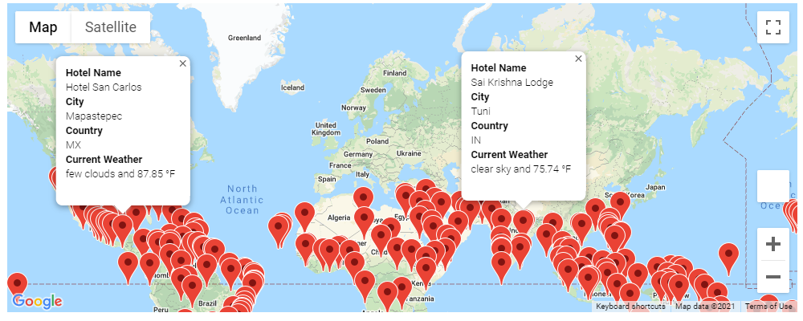
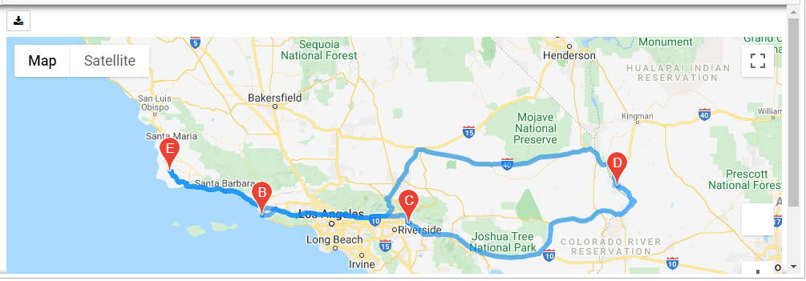

# World Weather Analysis

## Project Overview
An application titled, "PlanMyTrip, was developed to use data to recommend ideal hotels based upon the input of a client's weather preferences.  After the initial launch to beta testers, recommendations were made to enhance the application to include adding a weather description to the marker layer map of potential travel destinations.

## Purpose
Enhance the PlanMyTrip application by retrieving the weather description from the Open Weather API.  Using a client's input to filter weather preference data, potential travel destinations should by identified with nearby hotels.  A travel itinerary can be choosen from the potential destinations to produce a travel route.

## Resources
- [Current Weather API from openweathermap.org](https://openweathermap.org/current)
- [Nearby Search request for Google Places API](https://developers.google.com/maps/documentation/places/web-service/search-nearby?hl=en_US)
- [Google Directions API](https://developers.google.com/maps/documentation/directions/get-directions)
- [WeatherPy_Database.csv](Weather_Database/WeatherPy_Database.csv)
- Software: Python 3.7.10, Jupyter Notebook 6.3.0

## Process
Using numpy, a random selection of 2,000 coordinate combinations were generated and then citipy was invoked to find the nearest city to each coordinate.  A list of 772 cities was then created from the citipy module and used to employ the OpenWeather API.  Using JSON, the results were parsed to append the latitude, longitude, weather description, maximum temperature, percent humidity, percent cloudiness, wind speed, and county to the city list. The city list was then used to produce a dataframe which could be exported to a csv.  This produced the WeatherPy_Database.csv file.

The next step was to use the csv to narrow down potential travel destinations by capturing the input of a desired temperature range for the user's trip.  Then using the nearby search of Google Map's Place API, the first hotel returned was appended to the potential travel destination's dataframe.  After removing any rows where a hotel was not found, the WeatherPy_vacation.csv file was created.  Then a gmaps marker layer map was created with an information box.  The content in the information box was weather information for each city.

The final step was to utilize the WeatherPy_vacation.csv file to begin the creation of a travel itinerary.  A dataframe was created from the csv file and a marker layer map was generated with weather information in the info box of each marker.  Four cities, Lompoc, Port Hueneme, Redlands, and Lake Havasu City, were selected to created a round trip travel route.  A dataframe for each selected city was created and used to extract their latitude and longitude pairs as tuples using the to_numpy function and list indexing.  Google Map's Directions API was used to create a direction layer map.

The four city dataframes were then merged into one using the concat function.  The merged dataframe was then used to produce a travel map with markers that contained their weather data.

